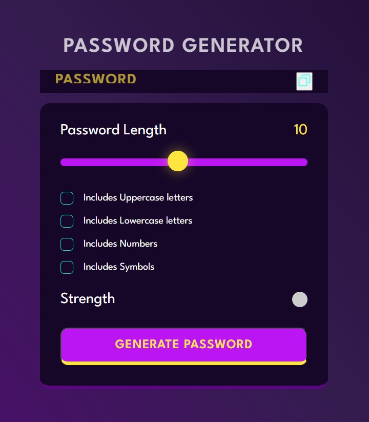

**Password Generator App README**

Welcome to the Password Generator App! This web application generates strong and secure passwords to help you safeguard your online accounts. This README provides an overview of the app's features, usage instructions, and technical details.

## Table of Contents

- [Introduction](#introduction)
- [Features](#features)
- [Usage](#usage)
- [Technical Details](#technical-details)
- [Credits](#credits)

## Introduction

The Password Generator App is a simple yet powerful tool built using JavaScript, CSS, and HTML. It allows users to generate complex and unique passwords that can enhance the security of their online accounts. With the increasing importance of cybersecurity, having strong passwords is essential to protect sensitive information from potential threats.

## Features

1. **Password Strength Options**: Choose between different levels of password strength, including weak, medium, and strong, based on your security needs.
2. **Customizable Length**: Specify the desired password length to meet the requirements of different websites and services.
3. **Character Sets**: The app generates passwords with a mix of lowercase letters, uppercase letters, numbers, and special characters for maximum security.
4. **Copy to Clipboard**: Easily copy the generated password to your clipboard with a single click for quick use.
5. **User-Friendly Interface**: A clean and intuitive interface makes it easy for users of all experience levels to generate passwords.

## Usage

1. **Access the App**: Open the `index.html` file in your preferred web browser to launch the Password Generator App.

2. **Select Password Criteria**:
   - Choose the desired password strength by selecting "Weak," "Medium," or "Strong."
   - Specify the password length using the provided input field.

3. **Generate Password**:
   - Click the "Generate Password" button to create a password based on your chosen criteria.

4. **Copy Password**:
   - Once a password is generated, click the "Copy to Clipboard" button to copy the password to your clipboard. You can then paste it into the password field of the website or application you are using.

5. **Generate Again**:
   - If you're not satisfied with the generated password, you can click the "Generate Password" button again to get a new one based on the same criteria.

## Technical Details

- **Languages Used**: JavaScript, CSS, HTML
- **Password Strength Logic**: The app uses a combination of character sets (lowercase letters, uppercase letters, numbers, and special characters) to create passwords of varying strength.
- **Clipboard Interaction**: The app leverages the `document.execCommand('copy')` method to copy the generated password to the clipboard.
- **Responsive Design**: The app is designed to work well on different screen sizes, from desktop to mobile devices.

## Credits

This Password Generator App was created by [Your Name]. If you have any questions, suggestions, or feedback, please feel free to contact me at [hemil.bict20@sot.pdpu.ac.in].

Thank you for using the Password Generator App! Stay safe and secure online.

